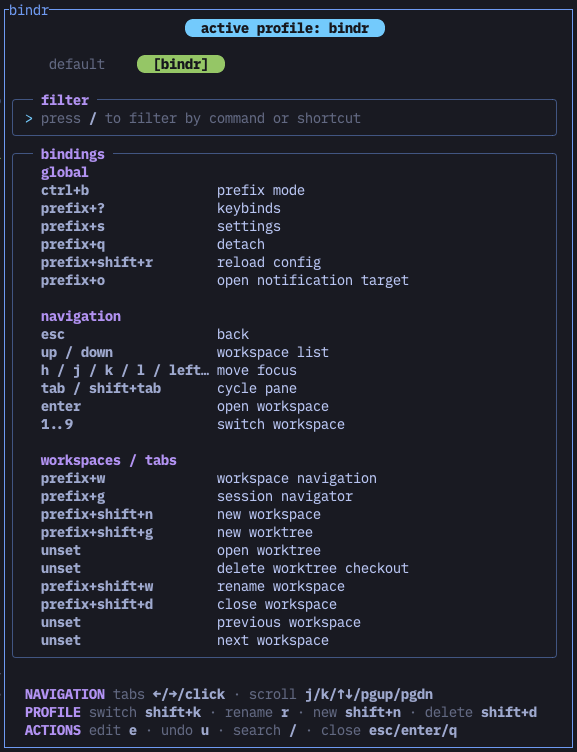

# bindr

Named keybinding profiles for [Herdr](https://herdr.dev). Switch between a
neutral `default` profile and your own shortcuts, or browse and edit any
profile in a terminal popup. Profiles contain a `[keys]` table and optional
plugin command overrides; switching changes only those bindings in Herdr's
configuration.



## What it does

- Cycle profiles in creation order, with `default` always first. Press
  `shift+k` again while the two-second toast is open to keep cycling, without
  repeating the plugin shortcut's prefix.
- Browse profiles without activating them. The active profile and viewed tab
  have separate indicators, and the toast can appear over the keybinds popup.
- Search commands and shortcuts with `/`. Edit scalar and plugin keybinds with
  `e`, capture a key with `enter`, type one manually with `m`, or unset it with
  `x`. Leaving edit mode asks whether to save or discard changes.
- See conflicting shortcuts in red, jump between them with `d`, or show only
  duplicates with `f`. Conflicts must be resolved before saving.
- Create a profile from the viewed one with `shift+n`, rename it with `r`,
  delete it with `shift+d`, and undo the last saved change with `u`. The
  generated `default` profile is read-only.

## Install

```sh
herdr plugin install itsmistermoon/bindr
```

Add shortcuts for the plugin actions to `~/.config/herdr/config.toml`:

```toml
[[keys.command]]
key = "prefix+shift+k"
type = "plugin_action"
command = "itsmistermoon.bindr.switch-profile"
description = "bindr: switch profile"

[[keys.command]]
key = "prefix+shift+e"
type = "plugin_action"
command = "itsmistermoon.bindr.show-keybinds"
description = "bindr: view keybinds"
```

Reload Herdr's configuration after adding them. For local development, use
`herdr plugin link <path-to-this-repo>` and run `cargo build --release`; linking
does not run the plugin's install build step.

## Try the `bindr` profile

The included [profile](examples/profiles/bindr.toml) is the author's daily
setup. It gives Herdr the familiar macOS tab, split, pane, and workspace
shortcuts while retaining `ctrl+b` as a prefix:

| Shortcut | Herdr action |
| --- | --- |
| `cmd+t`, `cmd+w` | New tab, close pane |
| `cmd+d`, `cmd+shift+d` | Split vertically, split horizontally |
| `cmd+]`, `cmd+[` | Cycle panes |
| `alt+tab`, `alt+shift+tab` | Next and previous Herdr tab |
| `cmd+1..9` | Switch workspace |

It also leaves `switch_tab`, `rename_tab`, and directional pane focus unbound.
Copy it into the plugin's profile directory from this checkout:

```sh
profile_dir="$(herdr plugin config-dir itsmistermoon.bindr)/profiles"
mkdir -p "$profile_dir"
cp examples/profiles/bindr.toml "$profile_dir/bindr.toml"
```

Open the keybinds popup to inspect it, or use `prefix+shift+k` to cycle to it.
The profile is an example: edit its bindings in the popup to suit your own
keyboard and workflow.

### Give those shortcuts to Herdr in Ghostty

On macOS, Ghostty handles many `cmd` combinations before Herdr sees them.
The companion [Ghostty configuration snippet](examples/ghostty-bindr.conf)
uses the same `unbind` rules as the author's local setup. Add its contents to
your Ghostty configuration and reload Ghostty. It releases Ghostty's tab,
split, pane, and digit shortcuts so the `bindr` profile can handle them.

The snippet sets `macos-option-as-alt = right`: use **Right Option+Tab** to
switch Herdr tabs, while Left Option still types macOS characters. It unbinds
both `cmd+1` and `cmd+digit_1` (and the corresponding pairs through 9), since
Ghostty has bindings for both the typed and physical digit keys. It also
unbinds `cmd+shift+[` and `cmd+shift+]` from Ghostty, although this profile
uses Right Option+Tab for tab navigation.

Ghostty's [`unbind` action](https://ghostty.org/docs/config/keybind/reference)
removes Ghostty's binding; it cannot release shortcuts captured by macOS or
another application. The approach follows the two guides in [See also](#see-also).

## Use the popup

| Key | Action |
| --- | --- |
| `←` / `→`, click | Browse profile tabs |
| `/` | Filter by command or shortcut |
| `e` | Edit the viewed profile |
| `enter` in edit mode | Listen for a replacement shortcut |
| `m` in edit mode | Type a shortcut, including ranges such as `prefix+1..9` |
| `x` in edit mode | Unset the selected binding |
| `esc` in edit mode | Review the save or discard prompt |
| `r`, `shift+n`, `shift+d` | Rename, create, or delete a profile |
| `u` | Undo the last saved profile change |

During capture, `enter` stages the new binding and `backspace` retries.
`ctrl+u` clears manual text. A saved edit to the active profile reloads Herdr;
an edit to another profile changes only that profile's file.

Profiles live at `HERDR_PLUGIN_CONFIG_DIR/profiles/<name>.toml`. To snapshot
the currently active keybindings into a new profile from this checkout, run:

```sh
./save-as.sh <profile-name>
```

## How it works

Switching a profile replaces `[keys]` in Herdr's live `config.toml` and
rewrites only the `key` field of matching `[[keys.command]]` blocks. Other
configuration remains untouched. An optional `[plugin_keys]` table in a
profile can override plugin command bindings by command ID:

```toml
[plugin_keys]
"herdr-bar.open" = "cmd+k"
```

The last saved change can be undone even after reopening the popup. Undo has
one level. Duplicate detection covers bindings inside the viewed profile;
the terminal, macOS, and other plugins may still intercept shortcuts.

Built with [`toml_edit`](https://docs.rs/toml_edit) and
[`crossterm`](https://docs.rs/crossterm).

## Development

```sh
cargo build --release
```

## See also

- [Making Ghostty and Herdr share one keyboard](https://dev.to/oronbz/making-ghostty-and-herdr-share-one-keyboard-4p0g)
- [Ghostty + Herdr keybindings](https://deepakness.com/raw/ghostty-herdr-keybindings/)
